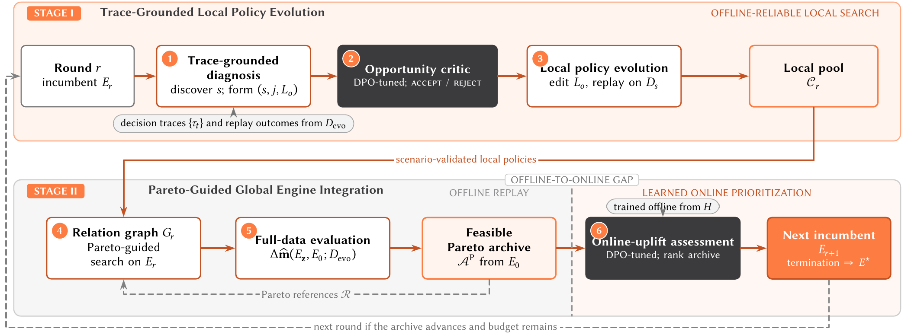

<div align="center">

# DispatchEvolve

**Autonomous Policy Evolution for Industrial Ride-Hailing Dispatch Engines with Multi-Objective Constraints**

Zirui Yuan<sup>1,*</sup> · Tengfei Lyu<sup>1,*</sup> · Kai Wan<sup>2</sup> · Xu Liu<sup>2</sup> · Zhui Sun<sup>2</sup> · Zihao Lu<sup>2</sup> · Li Ma<sup>2</sup> · Hao Liu<sup>1,†</sup>

<sup>1</sup> HKUST(GZ) &nbsp; <sup>2</sup> Didichuxing Co. Ltd.

<em>KDD 2027 ADS submission · Evaluated in four production A/B tests</em>

<sup>*</sup> Equal contribution; work done during internship at Didichuxing Co. Ltd. &nbsp; <sup>†</sup> Corresponding author

[**Project page**](https://dispatchevolve.github.io/) · [**Paper & full appendix (PDF)**](https://dispatchevolve.github.io/assets/DispatchEvolve.pdf) · [**Offline results**](https://dispatchevolve.github.io/#results) · [**Production A/B tests**](https://dispatchevolve.github.io/#production)

</div>

> **Research artifacts available; implementation forthcoming.** The paper, method overview, and experimental results are public. This repository does not yet contain runnable code or datasets. Release timing and licensing will be announced here.

## Overview

Industrial ride-hailing dispatch must balance completion, driver response, revenue, pickup time, and cancellations. Improving one metric in isolation can harm another; independently useful policy edits can also conflict when combined.

**DispatchEvolve connects scenario-specific policy search with whole-engine validation.** It discovers opportunities from decision traces, evolves the relevant policies under local guardrails, and integrates compatible edits using a cross-round Pareto archive. A historical A/B-trained assessment ranks feasible archived engines for the next online test; it does not replace replay validation.



### Stage I · Trace-Grounded Local Policy Evolution

1. Use decision traces and replay outcomes to discover scenario-specific opportunities, each identifying a scenario, target objective, and relevant policies.
2. Filter opportunities with a preference-tuned Opportunity Critic.
3. Evolve only the relevant policies and validate edits on scenario replay under local guardrails.

### Stage II · Pareto-Guided Global Engine Integration

1. Model hard conflicts and soft interactions among successful local candidates.
2. Propose combinations using candidate relations and references from the Pareto archive.
3. Evaluate complete engines, retain globally feasible non-dominated improvements, and rank archived engines for the next round or online test.

## Key results

All changes below are relative to each city's incumbent production engine. Offline replay and online A/B tests are separate evaluations.

| Evaluation | Finding |
| --- | --- |
| Held-out replay · Cities A–D | All six objectives improve in **4/4 cities**, the only evaluated method to do so |
| Macro-average feasible average improvement (FAI) | **0.350%**, versus **0.088%** for OpenEvolve, the strongest baseline by macro FAI |
| Evaluation efficiency | All six objectives improve on average after **15 engine evaluations**; the strongest baseline improves five after 30 |
| Online completion rate | Up to **+1.07%** (City E, nominally significant) |
| Online GMV | Up to **+1.32%** (City A, nominally significant) |
| Online driver cancellations after acceptance | Up to **−3.09%** (City A, nominally significant) |
| Online limitation | City A has a nominally significant **+0.82% ETA regression** |

**Coverage:** 7 findings above; 4 offline cities, 6 objectives, and 6 comparison baselines; 4 online tests in Cities A, B, E, and F. Estimated CR and GMV changes are positive in all 4 online tests, but not all are statistically significant. Offline feasibility does not guarantee online non-regression.

### Held-out offline performance

Two consecutive weeks of dispatch logs are split into an evolution week and a held-out test week. Positive, direction-aligned values indicate improvement: increases in CR, AR, and GMV; reductions in ETA, PCAA, and DCAA.

| City | FAI (%) | CR (%) | AR (%) | GMV (%) | ETA (%) | PCAA (%) | DCAA (%) |
| --- | --- | --- | --- | --- | --- | --- | --- |
| A | **0.616** | +1.193 | +1.475 | +0.290 | +0.011 | +0.149 | +0.578 |
| B | **0.300** | +0.717 | +0.459 | +0.032 | +0.125 | +0.084 | +0.384 |
| C | **0.195** | +0.204 | +0.209 | +0.018 | +0.367 | +0.085 | +0.285 |
| D | **0.290** | +0.124 | +0.706 | +0.395 | +0.022 | +0.196 | +0.299 |

**Coverage:** 4 city rows × 6 objectives = **24/24 positive objective changes**, with no missing entries. FAI is the arithmetic mean of the six changes only when all six strictly improve and the BR change is greater than −0.5%; otherwise it is zero. BR is a separate feasibility constraint, not a seventh averaged objective.

CR: completion rate · AR: answer ratio · GMV: gross merchandise value · ETA: estimated time of arrival · PCAA/DCAA: passenger/driver cancellation after acceptance · BR: broadcast rate.

See the [full offline comparison](https://dispatchevolve.github.io/#results) and [online estimates with p-values](https://dispatchevolve.github.io/#production).

## Paper & appendix reading guide

The [paper PDF](https://dispatchevolve.github.io/assets/DispatchEvolve.pdf) includes the complete appendix. Start with these sections depending on your question:

- **How does the loop work?** Section 3 and Appendix A: two-stage method, notation, and end-to-end algorithm.
- **Why local search followed by global integration?** Appendix B: design rationale and the roles of guardrails and the archive.
- **What does the theory establish?** Appendix C: finite-budget reachability, assumptions, and scope.
- **How is it evaluated?** Section 4 and Appendix D: baselines, evaluation efficiency, ablations, and detailed results.
- **What does deployment cost?** Appendix D: deployment cost, serving overhead, and online-uplift assessment.
- **What does an agent see?** Appendix D: policy-trace case study and abstracted prompt templates.

## Availability

- **Available now:** paper with full appendix, framework illustration, offline comparisons, component analyses, and production A/B results on the [project page](https://dispatchevolve.github.io/).
- **Forthcoming:** implementation and reproducibility artifacts. No installation command, runnable example, dataset download, or release date is available yet.
- **License:** to be specified with the code release; no open-source license is currently granted by this repository.

Watch this repository for release announcements or use [GitHub Issues](https://github.com/dispatchevolve/DispatchEvolve/issues) for public questions.

## Citation

Use the following citation for the current manuscript; publication metadata will be updated when available.

```bibtex
@misc{yuan2026dispatchevolve,
  title = {{DispatchEvolve}: Autonomous Policy Evolution for Industrial Ride-Hailing Dispatch Engines with Multi-Objective Constraints},
  author = {Yuan, Zirui and Lyu, Tengfei and Wan, Kai and Liu, Xu and Sun, Zhui and Lu, Zihao and Ma, Li and Liu, Hao},
  year = {2026},
  note = {Manuscript prepared for KDD 2027 ADS submission},
  url = {https://dispatchevolve.github.io/}
}
```

## Contact

- Zirui Yuan: [zyuan779@connect.hkust-gz.edu.cn](mailto:zyuan779@connect.hkust-gz.edu.cn)
- Tengfei Lyu: [tlyu077@connect.hkust-gz.edu.cn](mailto:tlyu077@connect.hkust-gz.edu.cn)
- Hao Liu (corresponding author): [liuh@ust.hk](mailto:liuh@ust.hk)
